# Meridian_LITE

Meridian_LITEは, ロボットのリアルタイムなデジタルツイン化を実現する**Meridian**(meridian flow system)の一部です.  
ESP32等のwifi付きマイコンボードに当リポジトリのファイルを書き込み, ロボットに搭載して使用します.  
センサーやサーボを制御しながら, PC等のデバイスとロボットの状態情報を100Hzの頻度で共有することができるようになります.  
  
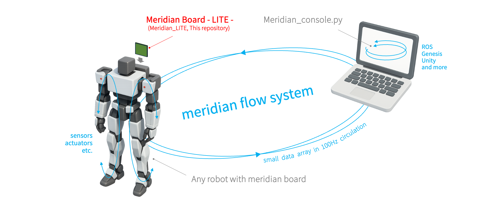  
  
システムの中核は[Meridim90](https://ninagawa123.github.io/Meridian_info/#Protocol/Meridim90/overview90/)というコンパクトで汎用的なデータ配列です.  
このデータ配列が中間プロトコルとしてデバイス間を高速に循環することで, リアルタイムな状態データの共有を実現します.  
Meridim90の介在により, メーカーの異なる複数のコマンドサーボやセンサ, UnityやROSなど既存のさまざまな開発環境やシミュレータが共存, 連携できるようになるのが大きな強みです.    
  
[](https://www.youtube.com/watch?v=4ymSV_Dot-U)  
  
Meridianはオープンソースプロジェクトとして2021年に開始し, 現在も様々なハードウェア, ソフトウェアへの対応を進めています.  
  
<br><hr>  

# Getting started 1
  
まず, ESP32DevKitC のみを使用した最小限の構成で動作確認を行います.  
  
## 導入の前提となる知識  
Meridian_LITEの動作確認にあたり,  
- Arduinoを使った電子工作の経験 (LチカレベルでOK)  
- pythonのコードを実行した経験 (コーディングの知識は不要)  
  
など, ごく初歩的な前提知識が必要となります.  
もしわからない部分がある方はこの機会にぜひ入門書や入門動画などで情報を得てください.  
それ以外の部分はなるべく全て解説するようにします.  
    
## 動作テスト用の準備物
- [ESP32-DevKitC](https://www.espressif.com/en/products/devkits/esp32-devkitc/overview) (マイコンボード, ([Espressifの正規品](https://www.espressif.com/en/products/devkits/esp32-devkitc/overview)を使用してください)  
- WiFi付きPC (Windows, Mac, Ubuntu のいずれか)  
- WiFiアクセスポイント (2.4Ghz通信対応)  
- USBケーブル (ESP32devkitCとPCを接続するためのもの)
- [PlatformIO](https://platformio.org/) 開発およびボード書き込み用のアプリケーション  
- python環境  
  
## PlatformIOのインストール  
ご利用の環境に合わせてPlatformIOをインストールします.  
参考URL:  
https://qiita.com/JotaroS/items/1930f156aab953194c9a  
https://platformio.org/  
  
## ESP32-DevKitC開発環境の導入
PlatformIOを起動し, 「Platformes」の検索窓で「ESP32」を検索します.  
  
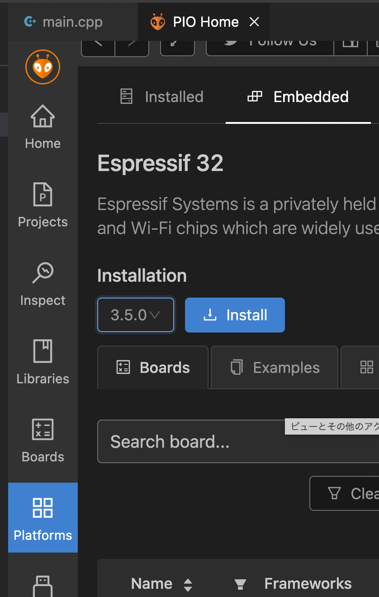
  
「Espressif 32」が見つかるので, バージョン「3.5.0」をインストールします.  
新しいバージョン(4.x.x)だとwifi関連がうまく動かない可能性が高いです.  
    
## ファイルをDLする  
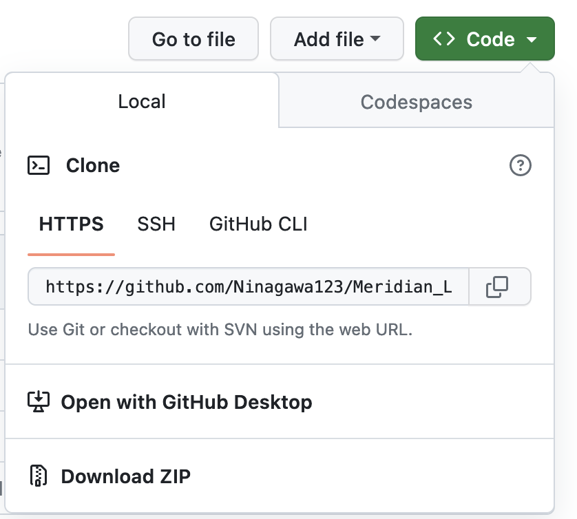
このサイトの右上の「Code」からzip形式などを選択してDLして適切な場所に解凍します.   
(もちろんgit cloneなどでもかまいません)  

## ワークスペースを開く  
VSCodeのファイルメニューから「ファイルでワークスペースをフォルダを開く...」を選択し, 先ほど準備したMeridian_LITE(Meridian_LITE-main)の中にある「Meridian_LITE_for_ESP32」→「Meridian_LITE_for_ESP32.code-workspace」を開きます.  
必要なライブラリはファイルを開く際にVSCode上で自動でインストールされます.  
  
### keys.hの修正  
keys.h内の  

```
#define AP_SSID "xxxxxx"             // アクセスポイントのAP_SSID  
#define AP_PASS "xxxxxx"             // アクセスポイントのパスワード  
#define SEND_IP "192.168.1.xx"       // 送り先のPCのIPアドレス（PCのIPアドレスを調べておく）  
```
  
の部分について, 接続するWiFiの**2.4GhzのアクセスポイントのSSID**と**パスワード**を設定します.  
(※ESP32-DevKitCは5Ghzには対応してません)  
また, **通信相手となるPCのIPアドレス** も設定します.  
<details>
<summary>PCのIPアドレスの調べ方</summary>
windows : ターミナルを開いてipconfigコマンド<br>
ubuntu : ターミナルでip aコマンド<br>
mac : 画面右上のwifiアイコンから"ネットワーク"環境設定...<br>
で確認できます.  
</details>
  
### config.hの修正  
ESP32-DevKitC単独動作テスト用に, config.hの設定を下記のように書き換えます.  
  
```config.h:102行目付近
...
// 各種ハードウェアのマウント有無
#define MOUNT_SD      0      // SDカードリーダーの有無 (0:なし, 1:あり)
#define MOUNT_IMUAHRS NO_IMU // IMU/AHRSの搭載 NO_IMU, MPU6050_IMU, MPU9250_IMU, BNO055_AHRS
#define MOUNT_PAD     PC     // ジョイパッドの搭載 PC, MERIMOTE, BLUERETRO, KRR5FH, WIIMOTE

// 動作モード
#define MODE_ESP32_STANDALONE 1 // ESP32をボードに挿さず動作確認（0:NO, 1:YES）
#define MODE_UDP_RECEIVE      1 // PCからのデータ受信（0:OFF, 1:ON, 通常は1）
#define MODE_UDP_SEND         1 // PCへのデータ送信（0:OFF, 1:ON, 通常は1）
...
```
  
## ビルドの確認とESP32-DevKitCへのアップロード（書き込み）  

### ビルドの確認
VSCodeの画面左下の**チェックマークのボタン**を押すと, ビルドが行われます.  
押下して「====== [SUCCESS] Took x.xx seconds」と表示されればビルド成功です.  
  

  
### ESP32-DevKitCへのアップロード
PCとESP32-DevKitCをUSBケーブルで接続し, チェックマークの隣の**矢印ボタン**を押すと必要なコードがESP32にアップロードされます.  
  
<details>
<summary>ESP32へのアップロードがうまくいかない場合</summary>
アップロードが失敗する場合でも, 何度か行うことで成功する場合があるので試してみてください.<br>
旧式のESP32DeckitCの場合, アップロード開始時にENボタンを押すことでうまくいく場合もあります. <br>
また, ESP32DeckitCのENとGNDの間に10uFのセラミックコンデンサを入れると, ENボタンを押さずとも書き込みができるようになる場合があります.<br>
</details>
  
### ESP32-DevKitCのIPアドレス確認  
VSCodeの画面左下の**コンセントマークのボタン**もしくは「ターミナル」のタブで, シリアルモニタを開きます.  
ESP32-DevKitC本体の**ENボタン**を押すと, ESP32が再起動し, 下記のようなメッセージが表示されます.  
  
```
...
WiFi connecting to => ********
WiFi successfully connected.
PC's IP address target => 192.168.**.**
ESP32's IP address => 192.168.xx.xx

-) Meridian -LITE- system on ESP32 now flows. (-
```
ここで**ESP32's IP address**の番号を書き留めておきます.  
(見逃した場合はESP32をリセットすればまた表示されます.)  
  
## Meridian consoleの導入と起動
### Meridian consoleの導入  
PC側のMeridain通信ソフトの一つである[Meridian console](https://github.com/Ninagawa123/Meridian_console)を起動します.    
ダウンロードや導入の方法については下記のURLに従ってください.  
https://github.com/Ninagawa123/Meridian_console  

さきほど書き留めた**ESP32's IP address**が必要となります.  

### Meridian consoleの起動  
Meridian consoleを起動し, ESP32DevKitCの電源が入っていると自動的に通信が始まります.  
通信が成功すると, Meridian consoleが動きはじめます.  
画面下部の **PCframe**と**BOARDframe**がカウントアップされ, **99~100Hz**の表記があれば通信成功です.  
  
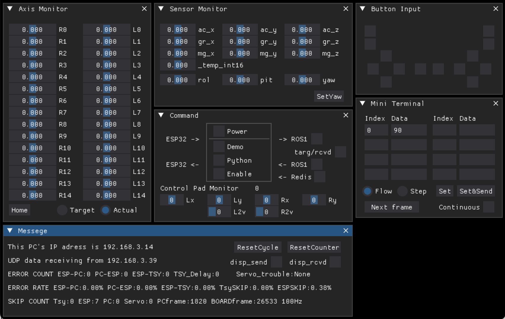

<details>
<summary>通信ができない場合</summary>
- Meridian consoleを起動した状態で, ESP32DevKitCを再起動してください.<br>
- 送信, 受信のIPアドレスを確認してください.特に3番目の番号など.<br>
- wifiルータが2.4Ghz対応で, 2.4Ghz用のSSIDに接続していることを確認してください.<br>
- config.hの内容を確認してください.<br>
- windowsの場合, firewall設定の変更が必要とされる場合があります.<br>
</details>
  
<br><hr>  

# Getting started 2
近藤科学の小型二足ロボットキット**KHR-3HV**へのMeridian Board搭載を例に, 導入方法を説明します.  
  
## KHR-3HVのMeridian動作テストの準備物
- 前述の動作テスト用の準備物
- [KHR-3HV](https://kondo-robot.com/product-category/robot/khrseries)本体
- 電源(KHR付属バッテリー, 安定化電源等)
- Meridian Board - LITE -
  
## Meridian Boaard - LITE - について  
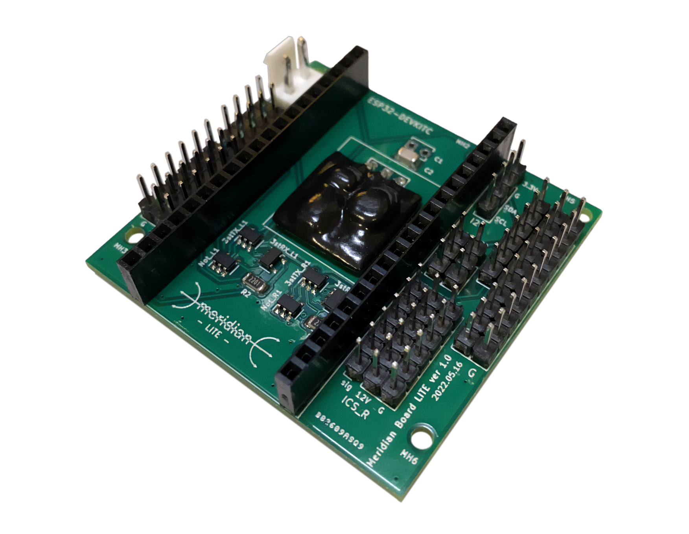  
  
"Meridian board -LITE-" はサーボ制御用の半二重通信回路2系統とSPI,I2Cなどの基本的な入出力ピンを備えたボードです. ESP32DevKitCを搭載し, サーボやセンサーを接続して使用します.  
  
### ボードの制作もしくは入手の方法　　
- [回路図を公開](docs/Meridian_Board_LITE_schema.pdf)しており, 自作することが可能です.  
- 完成品ボードの頒布もあります. [https://1985b.booth.pm/](https://1985b.booth.pm/)  
    
## Board と ESP32DevKitCのドッキング  

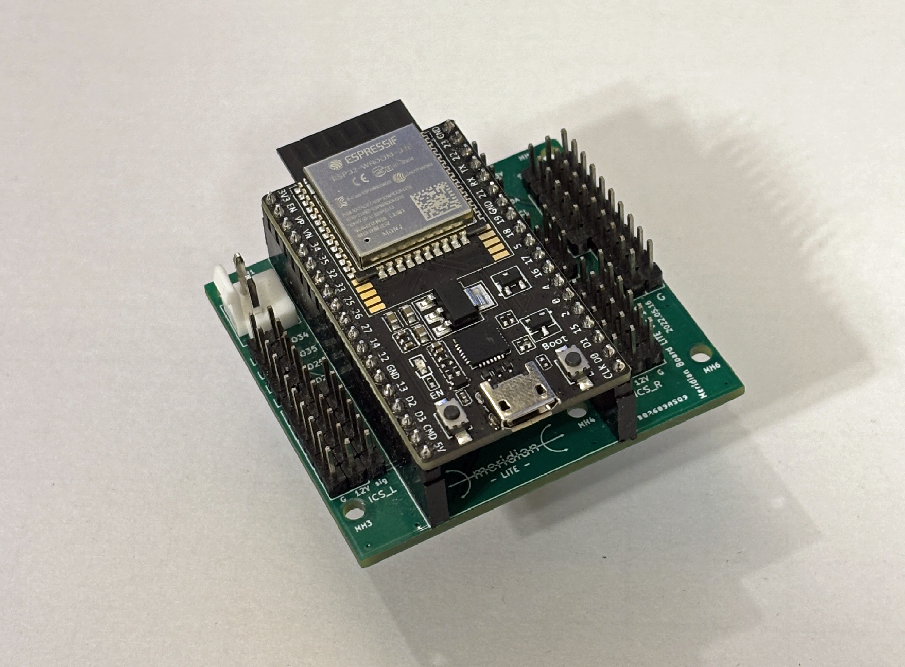

上図のようにESP32DevkitCのUSBコネクタがMeridian -LITE-のロゴ側を向くように搭載してください.  
ボードとPCの接続は, ESP32DevkitCのUSBをそのまま使用します.    
  
## ピンアサイン    
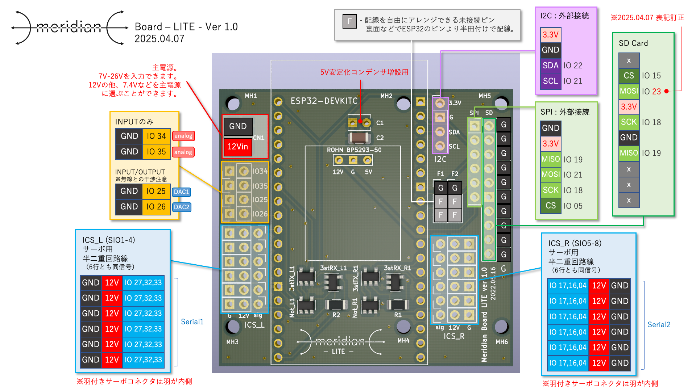
ピンアサインは上記の通りです. <br>
IOがESP32DevkitCのピン番号に該当しています.  
またSPIやSDカードを使用しない場合は, アサインされたピンをGNDと組み合わせるなどで他の役割を与えることもできます.   
Fとなっている箇所は未接続のピンとなっています. ESP32DevkitCのデータシート等を参考に背面で好きな箇所と導線をはんだ付けすることで自由に機能を与えることができます.  
  
特にサーボコネクタを逆やズラして刺すと半二重回路に負荷がかかりボード上のICが一発で壊れます. 接続は十分ご注意ください.  
    
## KHR-3HVへのマウントと機能拡張  
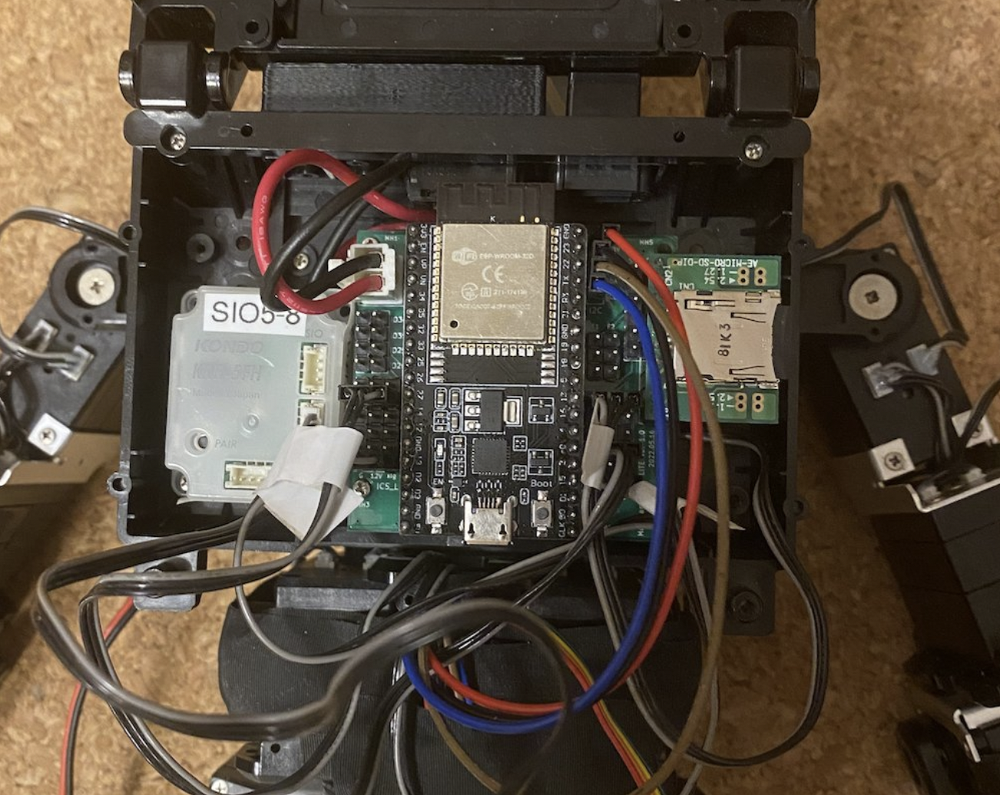

上図のようにKHR-3HVのランドセルに本体無改造で固定することができます.  
ランドセルとボードの間に1~2mm程度のスペーサーを入れると, ボード底面の干渉を回避できます.  
ピンアサイン図を参考に, サーボコネクタを接続してください.  
サーボの信号線（コネクタの羽）が内側を向くように接続してください.  
電源ケーブルについては, 初回のテスト時は接続不要です.(USB経由の5Vで動作します)  
  
<details>
<summary>周辺機器の拡張について</summary>
<b>SDカード:</b><br>
秋月電子で販売のSDカードホルダ[AE-MICRO-SD-DIP]をSPI端子にそのまま接続することができます. その場合は, SDカードホルダ側にメスのピンヘッダを取り付けてください.<br>
<b>９軸センサ:</b><br>
秋月で販売のBNO055[AE-BNO055-BO]をI2Cに接続することを標準としています.<br>
<b>リモコン:</b><br>
またリモコン受信機KRR-5FHも内臓できます. 左下のビス穴のみを使いた簡易固定ができます.<br>
蓋もギリギリですが閉じることができます.<br>
Wiiリモコンにも対応しており, config.hの#define MOUNT_PAD WIIMOTEと設定変更することですぐに使うことができます.<br>
</details>
  
## 設定変更とESP32-DevKitCへのアップロード   

### config.hの修正  
config.hの内容について, お手持ちのKHR-3HVの状況にあわせ適度に更新してください.  
設定の内容については, コード内にコメントを記しています.  
主な修正点は下記の通りです.  

```  
...
// 各種ハードウェアのマウント有無
#define MOUNT_SD      0      // SDカードリーダーの有無 (0:なし, 1:あり)
#define MOUNT_IMUAHRS NO_IMU // IMU/AHRSの搭載 NO_IMU, MPU6050_IMU, MPU9250_IMU, BNO055_AHRS
#define MOUNT_PAD     KRR5FH // ジョイパッドの搭載 PC, MERIMOTE, BLUERETRO, KRR5FH, WIIMOTE

// 動作モード
#define MODE_ESP32_STANDALONE 0 // ESP32をボードに挿さず動作確認（0:NO, 1:YES）
#define MODE_UDP_RECEIVE      1 // PCからのデータ受信（0:OFF, 1:ON, 通常は1）
#define MODE_UDP_SEND         1 // PCへのデータ送信（0:OFF, 1:ON, 通常は1）
...

// 各サーボ系統の最大サーボマウント数
#define IXL_MAX 15 // L系統の最大サーボ数. 標準は15.
#define IXR_MAX 15 // R系統の最大サーボ数. 標準は15.

// L系統のサーボのマウントの設定
int IXL_MT[IXL_MAX] = {... // サーボを設定している箇所に43, それ以外は0を設定.

// R系統のサーボのマウントの設定
int IXR_MT[IXR_MAX] = {... // サーボを設定している箇所に43, それ以外は0を設定.  
...

```

### ESP32-DevKitCへのアップロード
PCとボードをUSBで接続し, 内容をマイコンにアップロードしてください.  
USB経由で給電されシリアルモニタに起動時のステータスがメッセージとして表示されます.  
これでボード側の準備が整いました.  

## Meridian consoleの起動  
先ほどと同様に, Meridian consoleを起動してください.  
  
### 通信の確認  
通信が始まると,画面下部の **PCframe**と**BOARDframe**がカウントアップされ, **99~100Hz**の表記があれば通信成功です.  
     
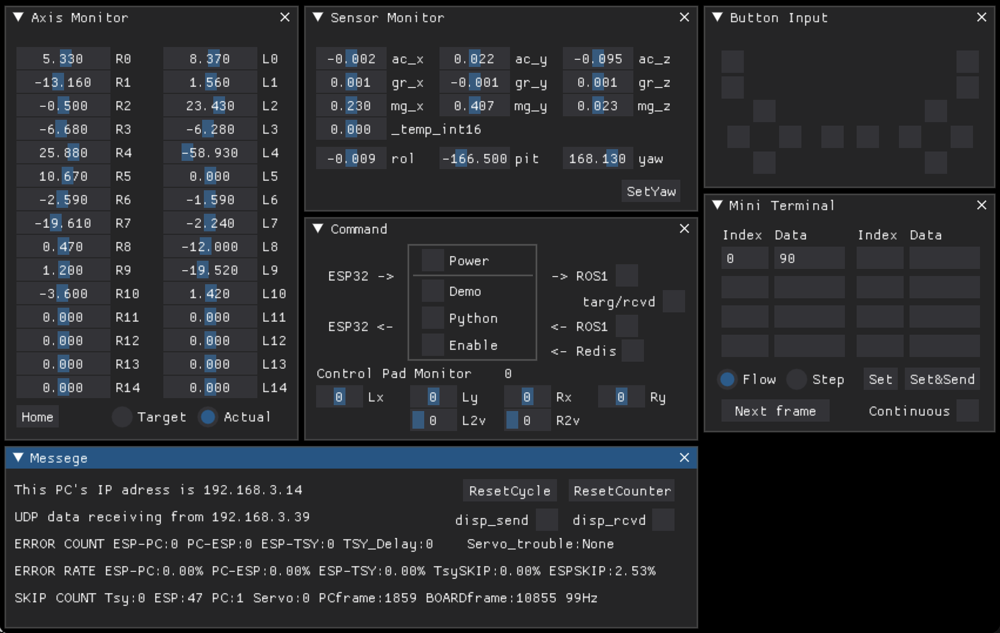  
  
今回はサーボを接続していますが, 初期状態では全サーボがトルクオフです.  
ロボットの関節を手で動かすと, 現在の角度がMeridian consoleのスライダーに反映されます.  
  
<details>
<summary>動作がおかしい時</summary>
<b>通信速度が100Hzにならない : </b><br>
・WiFiルーターが近くにあることを確認してください.<br>
・サーボが多すぎる場合に, 通信速度が100Hzに届かない場合があります.サーボ線や電源供給を確かめてください.<br>
・KHR-3HVの場合, 応答しないサーボが1つでもあると通信速度が大きく低下します.<br>
・サーボの通信速度が遅かったり, 接続するサーボが多すぎても100Hzを達成できない場合があります.<br>
・サーボのマウント設定を左右1個ずつにするなども試してみてください.<br>
・WIIリモコンを接続した際にも速度が低下します.これらは仕様です.<br>
<br>
<b>サーボの値がすごく暴れる : </b><br>
・サーボケーブルが長すぎると通信が安定しません.<br>
<br>
<b>L系統もしくはR系統しか動かない :  </b><br>
・半二重回路が故障している可能性があります.<br>
・PlatformIO.iniでのピン設定が反映されていない可能性があります.<br>
<br>
<b>一部のサーボが反応しない : </b><br>
なんらかの原因でサーボがファクトリーリセットなどを起こし, IDが0に書き変わったり, 通信設定が変更になってしまう場合があります.<br>  
該当のサーボが反応しなくなるだけでなく, トルクが勝手にオンになったり, ID競合により他のサーボまで誤動作することもあります.<br>
config.hで該当のサーボマウントを0に設定して再起動し, 問題箇所を特定してください.<br>
<br>
<b>PC連携時に数%の通信エラーが出る :  </b><br>
原因１: 仕様の範囲内<br>
特にサーボとのシリアル通信はESP32のスピードの限界ギリギリで動作しています.<br>
数秒に1フレーム程度のエラーが1%未満発生する場合がありますが, 正常な動作で, これをソフトウェア的に補完しています.<br>
原因２: サーボへの電力供給不足<br>
サーボへの電源供給が不足していると, サーボとの通信が不安定になります. その場合はサーボに正しく電力を供給してください.<br>
USBポートからの電力供給でもサーボが反応する場合もありますが, 反応しないサーボも多いです.<br>
原因３: ボードの加熱<br>
ESP32が発熱しすぎた場合も誤動作の原因となります.<br>  
ESP32にヒートシンクをつけるのもよいですし, 扇風機で風を当てるのも効果的です.<br>
原因４: ESP32へのBTリモコン接続<br>
おまけ機能でWIIリモコンのESP32接続に対応していますが, 数%のエラーが発生します.(現時点での正常動作です.どなたか改善を!)<br>
<br>
<b>ESP32が不定期にリセットする :  </b><br>
一時的な電力不足などにより使用中に強制リセットがかかる場合があります. ボードに十分な電力を供給してください.<br>  
サーボの電量をボードの通信用USBケーブルから供給している場合は, サーボをトルクオンすることは難しいでしょう.<br>
ボードのESP32の電源ソースにコンデンサを追加することでも, 電力不足によるリセットを軽減することができます.<br>
</details>

## サーボの設定の調整  
全てのサーボをオンにすると, USB給電の場合はおそらく電力不足となりますのでご注意ください.  
サーボの初期位置などが未設定であるため, 起動時に関節があらぬ方向に回転し, 大きな負荷がかかる可能性がありますので注意してください.  
初期位置の調整後, ロボットを吊るした状態などモーターへの負荷がほとんどない場合であれば, 全サーボオンが可能な場合があります.  
  
ID紐付け, 回転方向・トリム調整は[Meridan_console](https://github.com/Ninagawa123/Meridian_console)で行うことができます.  
設定方法は[Meridan_consoleのREADME](https://github.com/Ninagawa123/Meridian_console)に記載しています.  
  
[](https://www.youtube.com/watch?v=Wfc9j4Pmr3E)  
  
サーボ設定が済んだ上で, ボードに電源を接続し, Meridian consoleからdemoを実行すると, 100Hz更新のヌルヌルとしたダンスを披露します.  
  
# Unity版デモを実行する  
Meridian_LITEとUnityを連携させることができます.  
下記のリポジトリの内容をお試しください.  
[https://github.com/Ninagawa123/Meridian_Unity/tree/main](https://github.com/Ninagawa123/Meridian_Unity/tree/main)  
    
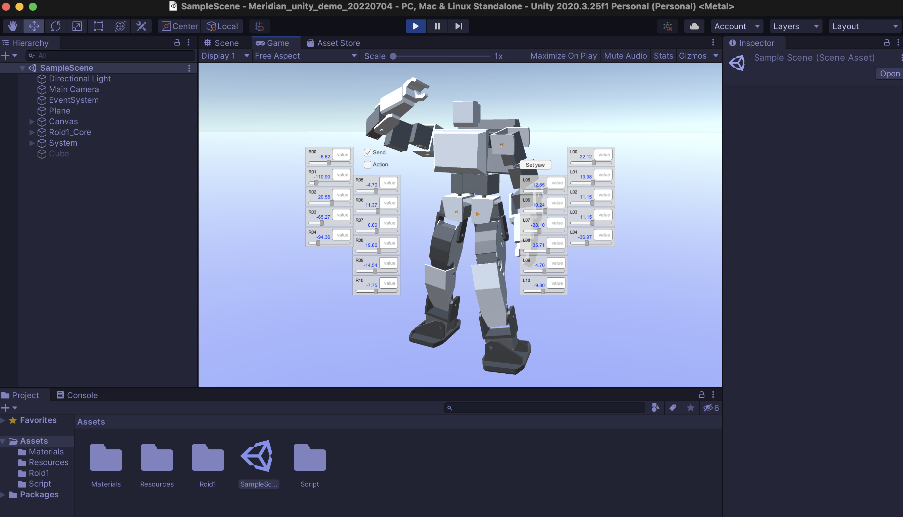
  
# ROS版デモを実行する  
Meridian_TWINとUnityを連携させることができます.  
下記のリポジトリより「ROS版デモを実行する」をお試しください.  
[https://github.com/Ninagawa123/Meridian_TWIN/tree/main](https://github.com/Ninagawa123/Meridian_TWIN/tree/main)  
  
# リモコンの使用方法  
**KRR-5FH/KRC5-FH**  
config.hにて「#define MOUNT_PAD KRR5FH」と設定してボードにアップロードします.  
受信機のKRR-5FHはボードの**R系統に接続**します. KRC-5FHのペアリングは製品の説明書の通りです.  
受信信号はMeridianに格納されるので, Meridian_console.pyでボタンの受信状況が確認できます.  
  
**WIIリモコン**  
wiiリモコンはおまけ機能です. (Meridianの通信速度が若干低下します.)  
config.hにて「#define MOUNT_PAD WIIMOTE」と設定してボードにアップロードします.  
起動直後にWiiリモコンの1,2ボタンを両押しするとペアリングが確立します.ヌンチャクのレバーも左側のアナログ十字スティックとして機能します.  
また, HOMEボタンがアナログスティックのキャリブレーション（リセット）として機能します.  
  
# バージョン更新履歴  
  
### 2024.08.18 v1.1.1  
コードをモジュールに分割し, Meridian_TWIN v1.1.0 と同等の構成にしました.  
命名規則を導入し, 大規模なリファクタリングを行いました.  
コードについて, Meridian_TWIN v1.1.1 との共通部分を増やしました.  
  
### 2024.08.19 v1.0.2  
大幅なリファクタリングを施したv1.1.1のリリースにあたり, 旧版の最新版をv1.0.2 としました.  
  
### 2023.09.15 v1.0.1  
\#define ESP32_STDALONE 0 をconfig.hに追加し, 値を1に設定することでESP32単体で通信テストが行えるようにしました.
その際, サーボ値は調べず, 代わりにL0番のサーボ値として+-30度のサインカーブを代入しつづけます. 
  
# トラブルシューティング    
  
## BNO055でデータが取得できない!  
**原因: プルアップが必要です**  
BNO_055とのI2C通信がうまくいかない場合は, 写真のように10kΩ程度の抵抗でプルアップすることでI2Cの通信品質が改善する場合があります.  
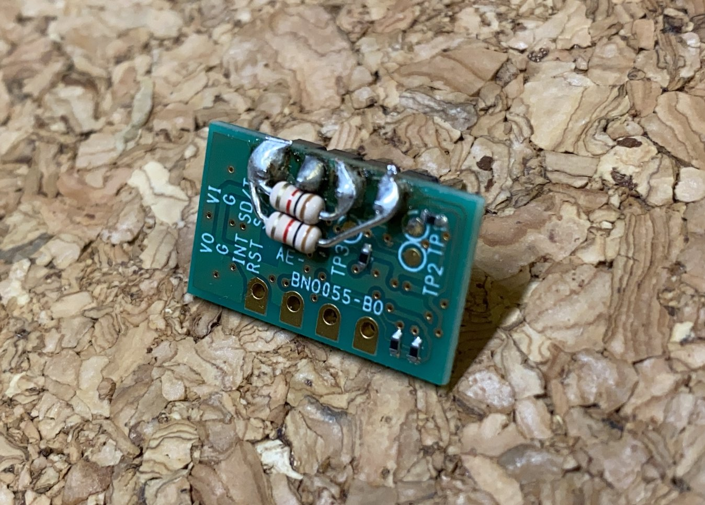  
  
## その他の情報    
コードの命名規則はLLVM準拠とし, 内容を "Meridian_LITE_for_ESP32/.clang-format" ファイルにコメントしています.    
フローチャートもDocsにて公開していますので改造の際にご利用ください.      
ライブラリの関数や変数表など, システムの詳細については以下のサイトがあります.  
[https://ninagawa123.github.io/Meridian_info/](https://ninagawa123.github.io/Meridian_info/)  

<details>
<summary>ファイル構造</summary>
  Meridian_LITE_for_ESP32<br>
│<br>
├── lib<br>
│   ├── IcsClass_V210  // KONDOサーボのライブラリ<br>
│   ├── wiimote        // WIIリモコンのライブラリ<br>
│   └── gs2d           // 今後対応予定のサーボライブラリ<br>
│<br>
├── src<br>
│   ├── config.h       // Meridianの主なconfig設定<br>
│   ├── keys.h         // wifiのSSIDやパスワード<br>
│   ├── main.cpp       // メインプログラム<br>
│   ├── main.h         // メインプログラムのヘッダファイル<br>
│   │<br>
│   ├── mrd_eeprom.h   // EEPROM関連<br>
│   ├── mrd_move.h     // モーション設定<br>
│   ├── mrd_disp.h     // メッセージ関連<br>
│   ├── mrd_bt_pad.h   // リモコンパッド関連<br>
│   ├── mrd_sd.h       // SDメモリ関連<br>
│   ├── mrd_servo.h    // サーボ処理<br>
│   ├── mrd_wifi.h     // WiFi関連<br>
│   ├── mrd_wire0.h    // I2C関連<br>
│   ├── mrd_util.h     // 細かい関数<br>
│   └── mrd_module     // モジュールディレクトリ<br>
│       ├── mv_firstIK.h    // 簡易IK関連（未定義）<br>
│       ├── mv_motionplay.h // モーション再生（未定義）<br>
│       ├── sv_dxl2.h       // ダイナミクセル制御（未定義）<br>
│       ├── sv_ftbrx.h      // 双葉サーボ制御（未定義）<br>
│       ├── sv_ftc.h        // Feetechサーボ制御（未定義）<br>
│       └── sv_ics.h        // KONDOサーボ制御  <br>
│<br>
├── .clang-format  // VSCODEでのコードフォーマット設定ファイル<br>
└── platformio.ini<br>
</details>

<details>
<summary>フローチャート</summary>
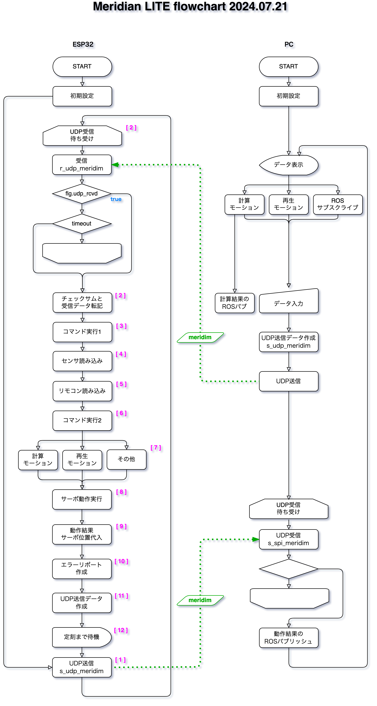
</details>
