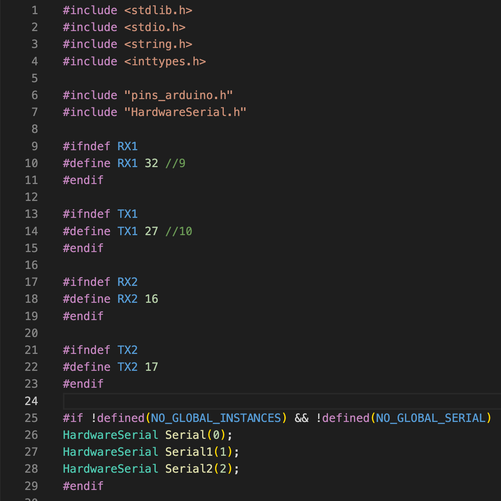
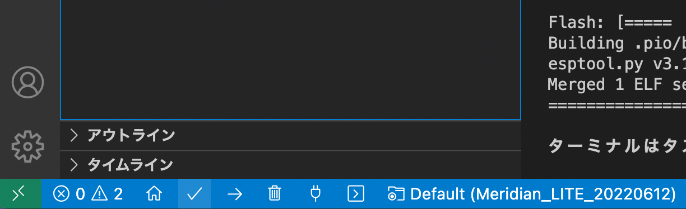

# [Meridian_LITE v1.1.1](https://github.com/Ninagawa123/Meridian_LITE/)
  
より改良・拡張しやすくするため, 大規模なリファクタリングを行いました.  
命名規則はLLVM準拠とし, 内容を "Meridian_LITE_for_ESP32/.clang-format" ファイルにコメントしています.  
またコードを構成要素ごとにヘッダーファイルで切り分け, モジュール化することで, 改造や拡張の見通しを立ちやすくしました.  
フローチャートもDocsにて公開しています.  
    
ライブラリの関数や変数表など, システムの詳細については以下のサイトがあります. 内容はv1.1.1に合わせました.  
[https://ninagawa123.github.io/Meridian_info/](https://ninagawa123.github.io/Meridian_info/)  
  
<br>  
  
## Meridianとは？  
Meridianはヒューマノイドの制御システムについてのオープンソースプロジェクトです.  
ホビーロボットのデジタルツイン化を簡単に実現し, PC上のシミュレーション空間とロボット実機をWiFi経由で1/100秒単位の更新頻度でデータリンクすることができます.  
  
システムの中核はMeridim配列という軽量で汎用的なデータ配列で, ロボットの状態データをコンパクトに格納できます.  
このデータ配列がデバイス間を高速に循環することで, リアルタイムな状態データの共有を可能にします.  
Meridim配列を中間プロトコルとして既存のシステムの間に挟むことで, 複数社のコマンドサーボやセンサ, Unityなどの開発環境などを自由に繋ぐことができ, またROSの入出力にも対応するため, シミュレーターなど多岐にわたるリソースを活用することができます.  
  
当リポジトリで取り扱う ”Meridian_LITE" はESP32DeckitCを使用するタイプで, 対応ボードはMeridian Board -LITE-となります.  
また, より高度な制御が可能となるESP32DeckitC+Teensy4.0を連携させて動作するMeridian_TWIN(対応ボードはMeridian Board Type.K)も開発済みです.  
  
Meridianは今後も用途に応じて様々なハードウェア, ソフトウェアに対応させていく予定です.  
  
[](https://www.youtube.com/watch?v=4ymSV_Dot-U)  
100Hzデータリンクのデモ動画
  
[](https://www.youtube.com/watch?v=Wfc9j4Pmr3E)  
100Hzダンスのデモ動画
<br>  
  
## Meridian_LITE ボードについて  
  
  
"Meridian board -LITE-" はサーボ制御用の半二重通信回路2系統とSPI,I2Cなどの基本的な入出力ピンを備えたボードです.  
ESP32devkitCを搭載し, 当リポジトリのスクリプトを使用することにより, 手軽に100Hzの更新頻度をもつデジタルツインのロボットを実現することができます.  
<br>
  
少量ですが完成品ボードの頒布もございます。  
<br>
[https://1985b.booth.pm/](https://1985b.booth.pm/)
  
  
### ピンアサイン    

ピンアサインは上記の通りです. <br>
IOがESP32DevkitCのピン番号に該当しているので, ESP32Devkitのデータシート等を参考に使用することができます.   
またSPIやSDカードを使用しない場合は, アサインされたピンをGNDと組み合わせるなどで他の役割を与えることもできます.   
Fとなっている箇所は未接続のピンとなっています. 背面で好きな箇所と導線をはんだ付けすることで自由に機能を与えることができます.  
搭載するESP32DevkitCはUSBコネクタがMeridian -LITE-のロゴ側を向くように設置してください.  
  
特にサーボコネクタを逆やズラして刺すと半二重回路に負荷がかかりボード上のICが一発で壊れるので, 接続は十分ご注意ください.   
<br>  
  
### KHR-3HVへのマウントと機能拡張  


上図のようにKHR-3HVのランドセルに本体無改造で固定することができます.  
ランドセル側とボードの間に1~2mm程度のスペーサーが入れるとボード底面の干渉を回避できます.  
秋月電子で販売のSDカードホルダ[AE-MICRO-SD-DIP]をSPI端子にそのまま接続することができます. その場合は, SDカードホルダ側にメスのピンヘッダを取り付けてください.   
９軸センサについては秋月で販売のBNO055[AE-BNO055-BO]をI2Cに接続することを標準としています.  
またリモコン受信機KRR-5FHも内臓できます. 左下のビス穴のみを使いた簡易固定ができます.  
蓋もギリギリですが閉じることができます.  
Wiiリモコンにも対応しており, すぐに使うことができます.    
<br>

## Meridian_LITE インストール方法  
Meridian LITE のボードを使う方法です.   
開発環境として, VScodeとPlatformIOを使用します.  
※ArduinoIDEを使用した場合, ESP32のWIFIライブラリの関係で無線通信が低速になる可能性が高いです.  
<br>

### PlatformIOのインストール  
ご利用の環境にPlatformIOをインストールしてください.  
参考URL  
https://qiita.com/JotaroS/items/1930f156aab953194c9a  
https://platformio.org/  
<br>

### 開発環境のインストール  
PlatformIOを起動し, 「Platformes」の検索窓で「ESP32」を検索します.  
  


<br>「Espressif 32」が見つかるので, バージョン「3.5.0」をインストールします.  
新しいバージョン(4.x.x)だとwifi関連がうまく動かない可能性が高いです.  
<br>
  
### ファイルをDLする  

このサイトの右上の「CODE」からzip形式などを選択してDLし, 適切な場所に解凍, 展開してください.  
慣れてている方はもちろんgit cloneなどでもかまいません.  
ファイル構造は以下の通りです.  
<br>
  
```  
Meridian_LITE_for_ESP32
│
├── lib
│   ├── IcsClass_V210  // KONDOサーボのライブラリ
│   ├── wiimote        // WIIリモコンのライブラリ
│   └── gs2d           // 今後対応予定のサーボライブラリ
│
├── src
│   ├── config.h       // Meridianの主なconfig設定
│   ├── keys.h         // wifiのSSIDやパスワード
│   ├── main.cpp       // メインプログラム
│   ├── main.h         // メインプログラムのヘッダファイル
│   │
│   ├── mrd_eeprom.h   // EEPROM関連
│   ├── mrd_move.h     // モーション設定
│   ├── mrd_disp.h     // メッセージ関連
│   ├── mrd_bt_pad.h   // リモコンパッド関連
│   ├── mrd_sd.h       // SDメモリ関連
│   ├── mrd_servo.h    // サーボ処理
│   ├── mrd_wifi.h     // WiFi関連
│   ├── mrd_wire0.h    // I2C関連
│   ├── mrd_util.h     // 細かい関数
│   └── mrd_module     // モジュールディレクトリ
│       ├── mv_firstIK.h    // 簡易IK関連（未定義）
│       ├── mv_motionplay.h // モーション再生（未定義）
│       ├── sv_dxl2.h       // ダイナミクセル制御（未定義）
│       ├── sv_ftbrx.h      // 双葉サーボ制御（未定義）
│       ├── sv_ftc.h        // Feetechサーボ制御（未定義）
│       └── sv_ics.h        // KONDOサーボ制御  
│
├── .clang-format  // VSCODEでのコードフォーマット設定ファイル
└── platformio.ini
  
```  
  
### フォルダを開く  
VSCodeのファイルメニューから「フォルダを開く...」を選択し, 展開したファイルの中にある「Meridian_LITE_for_ESP32」を開きます.  
<br>
  
### ライブラリのインストール  
必要なライブラリはVSCode上で自動でインストールされます.  
もし, 自動でインストールされない場合には, 下記を参考に必要なモジュールをインストールしてください.  
<br>

#### Meridianのライブラリを導入する   
アリ頭のアイコンから「QUICK ACCESS」→「PIO Home」→「Open」を開きます.  
右画面PIO Homeのタグの左メニューから「Libraries」を選択します.  
「Search libraries」となっている検索枠に「Meridian」と入力し, 「Meridian by Ninagawa123」を選択して「Add to Project」を押します. バージョンは0.1.0以上を使用してください.  
次に開くウインドの「Select a project」で今回のプロジェクト（Meridian_LITE_for_ESP32）を選択し, Addボタンを押します.  
<br>
  
#### Adafruit_BNO055のライブラリを導入する  
上記と同様手順で, 「Search libraries」となっている検索枠に「BNO055」と入力し, Adafruit BNO055を選択して「Add to Project」を押します.  
<br>
  
### ESP32のシリアル通信ピンの設定  
ESP32のデフォルトではSerial1のUARTシリアル通信が使う事ができないため, 設定を変更して使えるようにします.  
  
PlatformIOを一旦閉じます.  
  
https://qiita.com/Ninagawa_Izumi/items/8ce2d55728fd5973087d  
  
を参考に,  
RX1を9番ピンから32番ピンに変更,  
TX1を10番ピンから27番ピンに変更する設定をしておきます.  
  

  
この設定ができていないと, サーボ通信用のUARTは片方のチャンネルしか機能しません.  
<br>

### platformio.iniの設定  
「platformio.ini」を開くと下記のように設定されています.  
シリアルモニタのスピードを115200bpsとし, 自動インストールするモジュールを指定しています.  
またOTAという無線でのプログラム書き換え機能を削除してメモリ領域を増やす設定にしています.  
<br>
  
### keys.hの修正  
keys.h内の  

```
#define AP_SSID "xxxxxx"             // アクセスポイントのAP_SSID  
#define AP_PASS "xxxxxx"             // アクセスポイントのパスワード  
#define SEND_IP "192.168.1.xx"       // 送り先のPCのIPアドレス（PCのIPアドレスを調べておく）  
```
  
を使用環境に合わせて変更してください.  
送り先のPCのIPアドレスは,  
windowsならターミナルを開いてipconfigコマンド  
ubuntuならip aコマンド  
macなら画面右上のwifiアイコンから"ネットワーク"環境設定...  
で確認できます.  
<br>

### config.hの修正  
config.hの内容について, お手持ちの環境にあわせ適度に更新してください.  
設定の内容については, コード内にコメントを記しています.  
主な修正点は下記の通りです.  

```  
#define MOUNT_SD  1  
→ SDリーダーの搭載 (0:なし, 1:あり)  
  
#define MOUNT_IMUAHRS 1  
→ 6軸or9軸センサーの搭載 (0:なし, 1:BNO055, 2:MPU6050(未実装))  
  
// JOYPAD関連設定  
#define MOUNT_PAD KRR5FH (KHR-3HV標準のリモコン)  
#define MOUNT_PAD WIIMOTE (WIIリモコン, Meridianの通信速度が若干低下します.)  
  
// 各サーボのマウントの設定  
サーボを搭載しているIDにメーカーの番号を割り振ります. ※現在は43: KONDOのみ対応  
  
// 各サーボの内外回転プラスマイナス方向補正(1 or -1)  
// 各サーボのトリム値(degree)  
サーボのトリム値を設定します. ※トリム調整機能は未搭載.  
```
  
<br>

## ビルドとアップロード  


画面左下のチェックマークを押すと, ビルドが行われます.  
押下して「====== [SUCCESS] Took x.xx seconds」と表示されればビルド成功です.  
  
PCとESP32をUSBケーブルで接続し, 矢印ボタンを押すとESP32の内容が上書きされます.  
<br>
  
##### ESP32のアップロードがうまくいかない場合  
アップロードが失敗する場合でも, 何度か行うことで成功する場合があるので試してみてください.  
アップロード開始時にESP32DeckitCのENボタンを押すことでアップロードがうまくいく場合もあります.  
また, ESP32DeckitCのENとGNDの間に10uFのセラミックコンデンサを入れると, ENボタンを押さずとも書き込みができるようになる場合があります.
<br>
  
## ボードとロボットの起動  
これでボード側の準備が整いました.  
PCとボードをUSBで接続した状態でボードを起動すると,シリアルモニタに起動時のステータスがメッセージとして表示されます.  
ただし,PCとの連携にはPC側でMeridian Consolenを立ち上げておくなどの準備が必要になります.  
<br>
  
## Meridian consoleを実行する  
Meridianで受け取るデータを表示できるコンソールを用意しました.python3が使える環境で実行可能です.
下記のリポジトリより, PC側の設定を行い, 実行してください.
https://github.com/Ninagawa123/Meridian_console

  
<br>
  
## Unity版デモを実行する    
Meridian_LITEとUnityを連携させることができます.  
下記のリポジトリの内容をお試しください.  
[https://github.com/Ninagawa123/Meridian_Unity/tree/main](https://github.com/Ninagawa123/Meridian_Unity/tree/main)  
  

  
<br>

## ROS版デモを実行する    
Meridian_TWINとUnityを連携させることができます.  
下記のリポジトリより「ROS版デモを実行する」をお試しください.  
[https://github.com/Ninagawa123/Meridian_TWIN/edit/main/README.md](https://github.com/Ninagawa123/Meridian_TWIN/edit/main/README.md)  
<br>  
  
## リモコンの使用方法  
**KRR-5FH/KRC5-FH**  
config.hの「#define MOUNT_PAD KRR5FH」と設定してボードに書き込みます.  
受信機のKRR-5FHはボードの**R系統に接続**します. KRC-5FHのペアリングは製品の説明書の通りです.  
受信信号はMeridianに格納されるので, Meridian_console.pyでボタンの受信状況が確認できます.  
  
**WIIリモコン**  
v1.1.1 からwiiリモコンをおまけ機能として復活しました. (Meridianの通信速度が若干低下します.)  
config.hの「#define MOUNT_PAD WIIMOTE」と設定してボードに書き込み, 起動直後にWiiリモコンの1,2ボタンを両押しするとペアリングが確立します.ヌンチャクのレバーも左側のアナログ十字スティックとして機能します.  
また、HOMEボタンがアナログスティックのキャリブレーション（リセット）として機能します.  
<br>
  
## バージョン更新履歴  
  
#### 2024.08.18 v1.1.1  
コードをモジュールに分割し, Meridian_TWIN v1.1.0 と同等の構成にしました.  
命名規則を導入し, 大規模なリファクタリングを行いました.  
コードについて, Meridian_TWIN v1.1.1 との共通部分を増やしました.  
  
#### 2024.08.19 v1.0.2  
大幅なリファクタリングを施したv1.1.1のリリースにあたり, 旧版の最新版をv1.0.2 としました.  
  
#### 2023.09.15 v1.0.1  
\#define ESP32_STDALONE 0 をconfig.hに追加し, 値を1に設定することでESP32単体で通信テストが行えるようにしました.
その際, サーボ値は調べず, 代わりにL0番のサーボ値として+-30度のサインカーブを代入しつづけます. 
  
## トラブルシューティング  

### WiFiが繋がらない!  

ESP32は2.4GHzにしか対応していません.  
5Ghzにしか対応していないアクセスポイントに接続しようとしていないかご確認ください.  
またESP32にPC側のIPアドレス, PC側にESP32の正しいIPアドレスを設定する必要があります.  
  
### サーボ通信が片方しか使えない!  
  
**原因１: ESP32のピン設定が反映されてていない**  
ESP32DeckitCはデフォルト状態ではMeridianBoard-LITE-でシリアルを2チャンネル使うことはできません.  
上記「ESP32のシリアル通信ピンの設定」から, ESP32DevkitCのピン設定を確認してください. PlatformIO側の自動更新などで設定が戻ることもあるかもしれません.  
**2024.05.08追記：ピンアサインの設定方法が変更になったようです。対応方法は[こちら](https://qiita.com/Ninagawa123/items/8ce2d55728fd5973087d)をご覧ください。**  
  
**原因２: 半二重回路の故障**  
サーボと接続する半二重回路は繊細で, サーボコネクタの逆挿しやズラし挿しなどで故障してしまします.  
ちょっと大変ですが表面実装を修理できる道具やスキルがある方はご自身で修理することも可能です. 修理用のチップをBOOTHにて頒布しています.   
  
### 一部のサーボが反応しない!  
なんらかの原因でサーボがファクトリーリセットなどを起こし, IDが0に書き変わったり, 通信設定が変更になってしまう場合があります.  
該当のサーボが反応しなくなるだけでなく, トルクが勝手にオンになったり, ID競合により他のサーボまで誤動作することもあります.  
config.hで該当のサーボマウントを0に設定して再起動し, 問題箇所を特定してください.  
  
### 通信速度が100Hzにならない!  
サーボが多すぎる場合に, 通信速度が100Hzに届かない場合があります.サーボ線や電源供給を確かめてください.  
KHR-3HVの場合, 応答しないサーボが1つでもあると通信速度が大きく低下します.  
またサーボの通信速度が遅かったり, 接続するサーボが多すぎても100Hzを達成できない場合があります.  
WIIリモコンを接続した際にも速度が低下します.これらは仕様です.  
  
### BNO055でデータが取得できない!  
**原因: プルアップが必要です**  
BNO_055とのI2C通信がうまくいかない場合は, 写真のように10kΩ程度の抵抗でプルアップすることでI2Cの通信品質が改善する場合があります.  
  
  
### PC連携時に数%の通信エラーが出る!  
**原因１: 仕様の範囲内**  
特にサーボとのシリアル通信はESP32のスピードの限界ギリギリで動作しています.  
数秒に1フレーム程度のエラーが1%未満発生する場合がありますが, 正常な動作で, これをソフトウェア的に補完しています.  
**原因２: サーボへの電力供給不足**  
サーボへの電源供給が不足していると, サーボとの通信が不安定になります. その場合はサーボに正しく電力を供給してください.  
USBポートからの電力供給でもサーボが反応する場合もありますが, 反応しないサーボも多いです.  
**原因３: ボードの加熱**  
ESP32が発熱しすぎた場合も誤動作の原因となります.  
ESP32にヒートシンクをつけるのもよいですし, 扇風機で風を当てるのも効果的です.  
**原因４: ESP32へのBTリモコン接続**  
おまけ機能でWIIリモコンのESP32接続に対応していますが, 数%のエラーが発生します.(現時点での正常動作です.どなたか改善を!)  
  
### ESP32が不定期にリセットする!  
一時的な電力不足などにより使用中に強制リセットがかかる場合があります. ボードにも十分な電力を供給してください.  
サーボの電量をボードの通信用USBケーブルから供給している場合は, サーボをトルクオンすることは難しいでしょう.  
ボードのESP32の電源ソースにコンデンサを追加することでも, 電力不足によるリセットを軽減することができます.  
