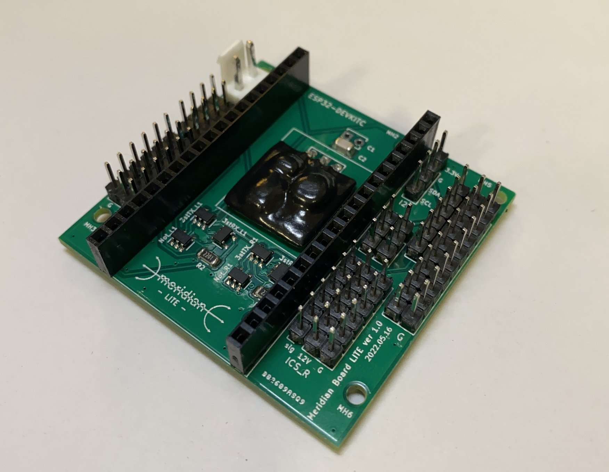
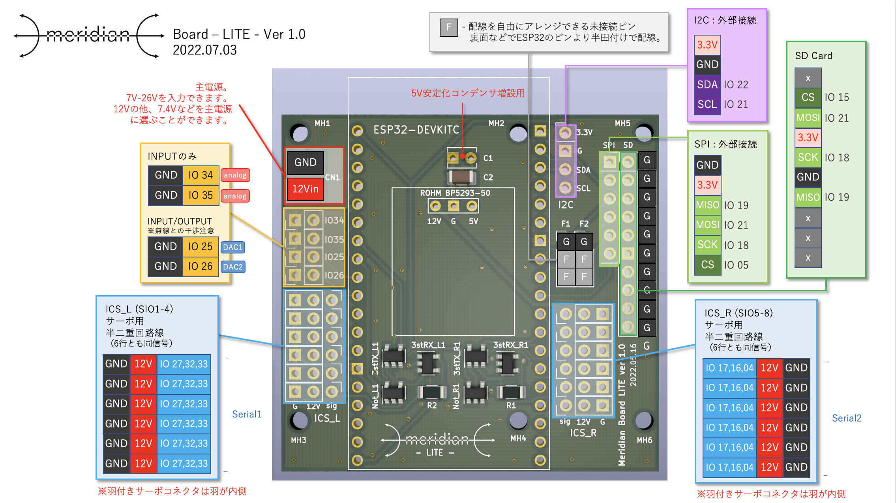
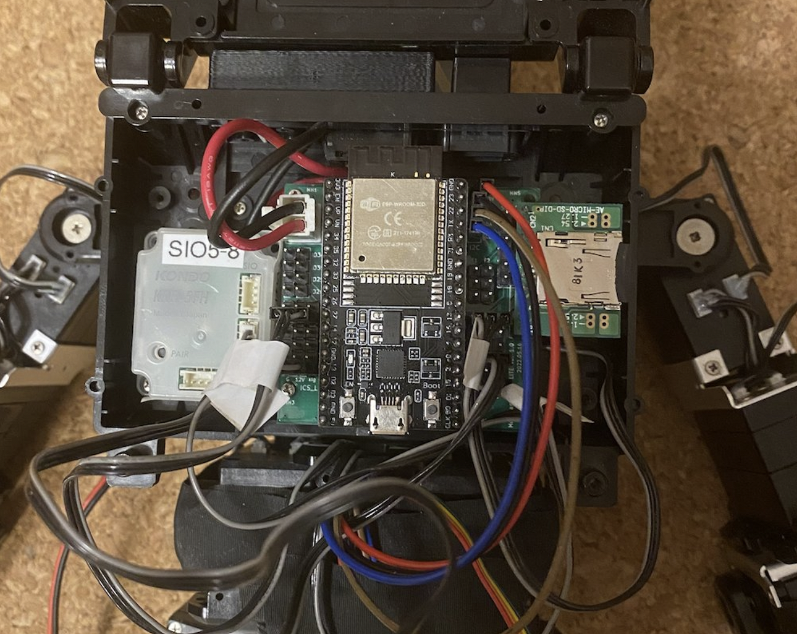

Meridian_LITE ボードについて
===

"Meridian board -LITE-" はサーボ制御用の半二重通信回路2系統とSPI,I2Cなどの基本的な入出力ピンを備えたボードです.  
ESP32devkitCを搭載し, 当リポジトリのスクリプトを使用することにより, 手軽に100Hzの更新頻度をもつデジタルツインのロボットを実現することができます.  

## ピンアサイン

ピンアサインは上記の通りです.  
IOがESP32DevkitCのピン番号に該当しているので, ESP32Devkitのデータシート等を参考に使用することができます.  
またSPIやSDカードを使用しない場合は, アサインされたピンをGNDと組み合わせるなどで他の役割を与えることもできます.  
Fとなっている箇所は未接続のピンとなっています. 背面で好きな箇所と導線をはんだ付けすることで自由に機能を与えることができます.  
搭載するESP32DevkitCはUSBコネクタがMeridian -LITE-のロゴ側を向くように設置してください.  

特にサーボコネクタを逆やズラして刺すと半二重回路に負荷がかかりボード上のICが一発で壊れるので, 接続は十分ご注意ください.  

## KHR-3HVへのマウントと機能拡張

上図のようにKHR-3HVのランドセルに本体無改造で固定することができます.  
ランドセル側とボードの間に1~2mm程度のスペーサーが入れるとボード底面の干渉を回避できます.  
秋月電子で販売のSDカードホルダ[AE-MICRO-SD-DIP]をSPI端子にそのまま接続することができます. その場合は, SDカードホルダ側にメスのピンヘッダを取り付けてください.  
９軸センサについては秋月で販売のBNO055[AE-BNO055-BO]をI2Cに接続することを標準としています.  
またリモコン受信機KRR-5FHも内臓できます. 左下のビス穴のみを使いた簡易固定ができます.  
蓋もギリギリですが閉じることができます.  
Wiiリモコンにも対応しており, すぐに使うことができます.  
