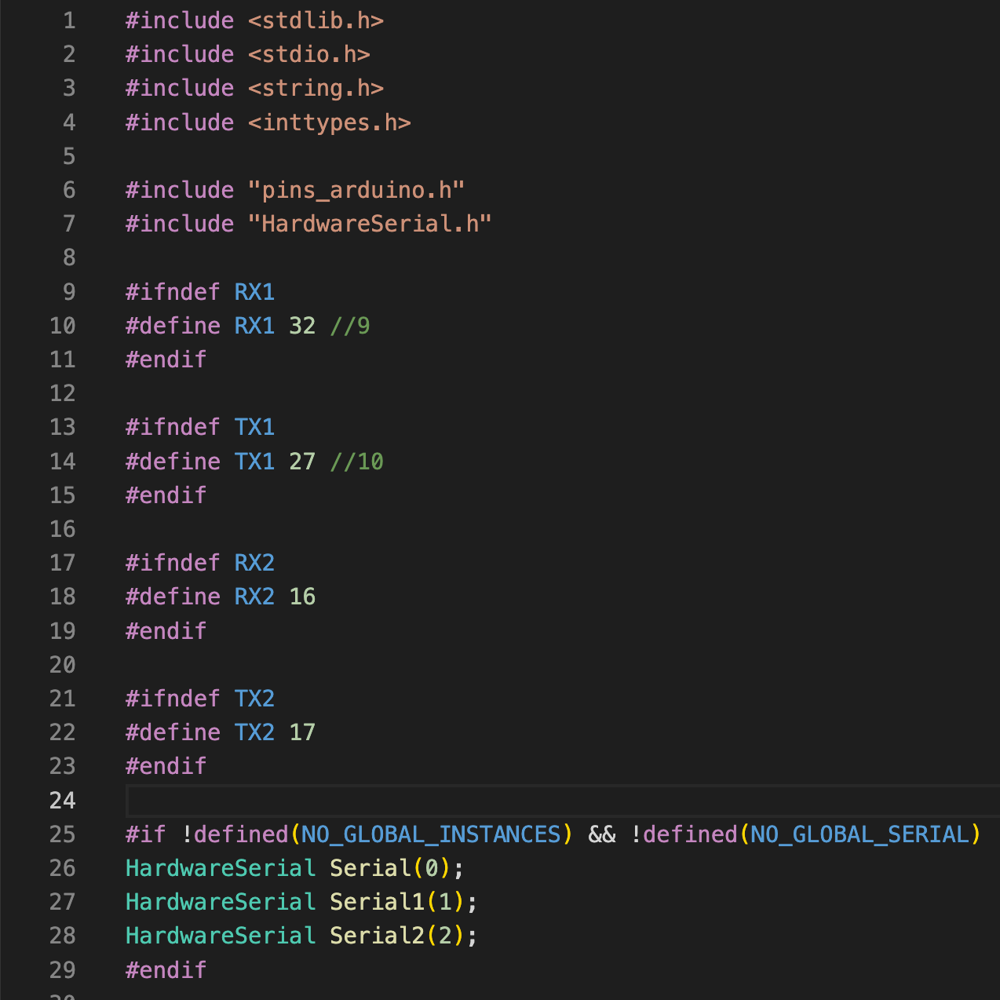
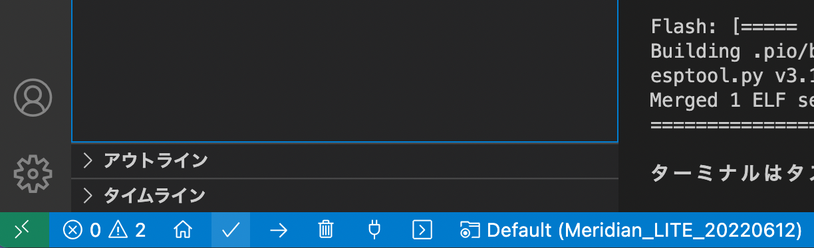

Meridian_LITE インストール方法
===

Meridian LITE のボードを使う方法です.   
開発環境として, VScodeとPlatformIOを使用します.  
※ArduinoIDEを使用した場合, WIFIライブラリの関係でESP32のパフォーマンスが発揮しきれません.  
    
## PlatformIOのインストール  
ご利用の環境にPlatformIOをインストールしてください.   
参考URL  
https://qiita.com/JotaroS/items/1930f156aab953194c9a  
https://platformio.org/  
  
## 開発環境のインストール  
PlatformIOを起動し, 「Platformes」の検索窓で「ESP32」を検索します.  
  
 「Espressif 32」が見つかるので, バージョン「3.5.0」をインストールします.  
新しいバージョン(4.x.x)だとwifi関連がうまく動かない可能性が高いです.  
    
## ファイルをDLする  
   
このサイトの右上の「CODE」からzip形式などを選択してDLし, 適切な場所に解凍, 展開してください.  
慣れてている方はもちろんgit cloneなどでもかまいません.  
  
## フォルダを開く  
VSCodeのファイルメニューから「フォルダを開く...」を選択し, 展開したファイルの中にある「Meridian_LITE_for_ESP32」を開きます.  
    
## ライブラリのインストール  
必要なライブラリはVSCode上で自動でインストールされます.  
もし, 自動でインストールされない場合には, 下記を参考に必要なモジュールをインストールしてください.   
  
### Meridianのライブラリを導入する   
アリ頭のアイコンから「QUICK ACCESS」→「PIO Home」→「Open」を開きます.  
右画面PIO Homeのタグの左メニューから「Libraries」を選択します.  
「Search libraries」となっている検索枠に「Meridian」と入力し, 「Meridian by Ninagawa123」を選択して「Add to Project」を押します. バージョンは0.1.0以上を使用してください.  
次に開くウインドの「Select a project」で今回のプロジェクト（Meridian_LITE_for_ESP32）を選択し, Addボタンを押します.  
  
### Adafruit_BNO055のライブラリを導入する  
上記と同様手順で, 「Search libraries」となっている検索枠に「BNO055」と入力し, Adafruit BNO055を選択して「Add to Project」を押します.  
  
## ESP32のシリアル通信ピンの設定  
ESP32のデフォルトではSerial1のUARTシリアル通信が使う事ができないため, 設定を変更して使えるようにします.  
  
PlatformIOを一旦閉じます.  

https://qiita.com/Ninagawa_Izumi/items/8ce2d55728fd5973087d  

を参考に,   
RX1を9番ピンから32番ピンに変更,  
TX1を10番ピンから27番ピンに変更する設定をしておきます.  

この設定ができていないと, サーボ通信は片方のチャンネルしか機能しません. 　　
　　 
## platformio.iniの設定  
「platformio.ini」を開くと下記のように設定されています.  
シリアルモニタのスピードを115200bpsとし, 自動インストールするモジュールを指定しています.  
またOTAという無線でのプログラム書き換え機能を削除してメモリ領域を増やす設定にしています.  
  
## keys.hの修正  
keys.h内の  
#define AP_SSID "xxxxxx"             // アクセスポイントのAP_SSID  
#define AP_PASS "xxxxxx"             // アクセスポイントのパスワード  
#define SEND_IP "192.168.1.xx"       // 送り先のPCのIPアドレス（PCのIPアドレスを調べておく）  
  
を使用環境に合わせて変更してください.  
送り先のPCのIPアドレスは,  
windowsならターミナルを開いてipconfigコマンド  
ubuntuならip aコマンド  
macなら画面右上のwifiアイコンから"ネットワーク"環境設定...  
で確認できます.   
    
## config.hの修正  
config.hの内容について, お手持ちの環境にあわせ適度に更新してください.  
設定の内容については, コード内にコメントを記しています.  
主な修正点は下記の通りです.  
  
#define SD_MOUNT 1  
→ SDリーダーの搭載 (0:なし, 1:あり)  
  
#define IMU_MOUNT 1  
→ 6軸or9軸センサーの搭載 (0:なし, 1:BNO055, 2:MPU6050(未実装))  
  
// JOYPAD関連設定  
#define MOUNT_PAD KRR5FH   
  
// 各サーボのマウントの設定  
サーボを搭載しているIDにメーカーの番号を割り振ります. ※現在は43: KONDOのみ対応  
  
// 各サーボの内外回転プラスマイナス方向補正(1 or -1)  
// 各サーボのトリム値(degree)  
サーボのトリム値を設定します. ※トリム調整機能は未搭載.  
    
## ビルドとアップロード  
 
画面左下のチェックマークを押すと, ビルドが行われます.  
押下して「====== [SUCCESS] Took x.xx seconds」と表示されればビルド成功です.  
  
PCとESP32をUSBケーブルで接続し, 矢印ボタンを押すとESP32の内容が上書きされます.  
##### ESP32のアップロードがうまくいかない場合  
アップロードが失敗する場合でも, 何度か行うことで成功する場合があるので試してみてください.  
アップロード開始時にESP32DeckitCのENボタンを押すことでアップロードがうまくいく場合もあります.  
また, ESP32DeckitCのENとGNDの間に10uFのセラミックコンデンサを入れると, ENボタンを押さずとも書き込みができるようになる場合があります.

## ボードとロボットの起動  
これでボード側の準備が整いました.  
PCとボードをUSBで接続した状態でボードを起動すると,シリアルモニタに起動時のステータスがメッセージとして表示されます.  
ただし,PCとの連携にはPC側でMeridian Consolenを立ち上げておくなどの準備が必要になります.  
  